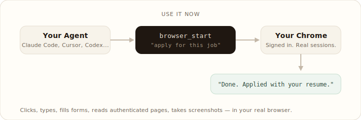
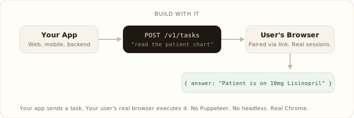

<div align="center">


# Hanzi Browse

**给你的 AI agent 一个真实浏览器。**

一次工具调用，就能把整段任务交给 agent 去完成。它会在你已经登录过的真实浏览器里点击、输入、填写表单，<br/>
读取需要登录才能访问的页面，而不是在一个和你账号状态脱节的沙盒里“脑补”。

[](https://www.npmjs.com/package/hanzi-browse)
[](https://chrome.google.com/webstore/detail/iklpkemlmbhemkiojndpbhoakgikpmcd)
[](https://discord.gg/hahgu5hcA5)
[](../../LICENSE)

**适配**

<a href="https://claude.ai/code"></a>&nbsp;&nbsp;
<a href="https://cursor.com"></a>&nbsp;&nbsp;
<a href="https://openai.com/codex"></a>&nbsp;&nbsp;
<a href="https://ai.google.dev/gemini-api/docs/cls"></a>&nbsp;&nbsp;
&nbsp;&nbsp;
&nbsp;&nbsp;
&nbsp;&nbsp;


<br/>

[](https://www.youtube.com/watch?v=3tHzg2ps-9w)

</div>

<br/>

## 使用 Hanzi 的两种方式

### 现在就用：给你的 agent 一个浏览器



### 集成到产品里：把浏览器自动化嵌进你的应用



<br/>

## 快速开始

```bash
npx hanzi-browse setup
```

这一个命令会把主要步骤都串起来：

```text
npx hanzi-browse setup
│
├── 1. 检测浏览器 ───── Chrome、Brave、Edge、Arc、Chromium
│
├── 2. 安装扩展 ────── 打开 Chrome Web Store，并等待安装完成
│
├── 3. 检测 AI agent ─ Claude Code、Cursor、Codex、Windsurf、
│                      VS Code、Gemini CLI、Amp、Cline、Roo Code
│
├── 4. 配置 MCP ───── 将 hanzi-browse 合并进各 agent 的配置
│
├── 5. 安装技能 ───── 把浏览器相关技能复制到各 agent
│
└── 6. 选择 AI 模式 ── Managed（$0.05/任务）或 BYOM（永久免费）
```

- **Managed**：官方托管模型与任务执行。每月 20 个免费任务，之后按 $0.05/任务计费，不需要 API Key。
- **BYOM**：Bring Your Own Model。你可以使用 Claude Pro/Max、GPT Plus 或自己的 API Key。永久免费，本地运行。

如果你在中国区网络环境、Windows PowerShell，或者 Chrome Web Store 不稳定，建议再看这份更实操的说明：

- [中文安装指南](./setup-guide.md)

<br/>

## 示例

```text
"打开 Gmail，帮我退订最近一周的营销邮件"
"去 careers.acme.com 帮我投递 senior engineer 岗位"
"登录我的银行账户，把上个月账单下载下来"
"去 LinkedIn 帮我找旧金山的 AI 工程师岗位"
```

<br/>

## Skills

安装向导会自动把浏览器技能装进你的 agent。技能的作用，是教 agent 在什么场景下该用浏览器，以及该怎么用浏览器完成特定流程。

| Skill | 说明 |
|-------|------|
| `hanzi-browse` | 核心技能，定义何时以及如何使用浏览器自动化 |
| `e2e-tester` | 在真实浏览器里测试你的应用，并带截图反馈问题 |
| `social-poster` | 按不同平台改写文案，并用你已登录的账号发布 |
| `linkedin-prospector` | 寻找潜在客户或候选人，并发送个性化连接请求 |
| `a11y-auditor` | 在真实浏览器里执行无障碍检查 |
| `x-marketer` | 面向 Twitter / X 的营销工作流 |

开源可扩展，你也可以[自己写技能](https://github.com/hanzili/hanzi-browse/tree/main/server/skills)。

<br/>

## 基于 Hanzi Browse 构建产品

把浏览器自动化嵌进自己的产品里。你的应用调用 Hanzi API，真实浏览器执行任务，然后把结果返回给你。

1. **获取 API Key**：登录[开发者后台](https://api.hanzilla.co/dashboard)并创建 key
2. **配对浏览器**：创建 pairing token，把配对链接（`/pair/{token}`）发给用户，用户点击后会自动配对
3. **发起任务**：向 `POST /v1/tasks` 发送任务内容和浏览器 session ID
4. **获取结果**：轮询 `GET /v1/tasks/:id` 直到完成，或者直接使用会阻塞等待的 `runTask()`

```typescript
import { HanziClient } from '@hanzi/browser-agent';

const client = new HanziClient({ apiKey: process.env.HANZI_API_KEY });

const { pairingToken } = await client.createPairingToken();
const sessions = await client.listSessions();

const result = await client.runTask({
  browserSessionId: sessions[0].id,
  task: 'Read the patient chart on the current page',
});
console.log(result.answer);
```

[API 文档](https://browse.hanzilla.co/docs.html#build-with-hanzi) · [开发者后台](https://api.hanzilla.co/dashboard) · [示例集成](../../examples/partner-quickstart/)

<br/>

## 工具

| Tool | 说明 |
|------|------|
| `browser_start` | 发起一个任务，并阻塞等待直到任务完成 |
| `browser_message` | 向现有会话发送后续指令 |
| `browser_status` | 查询任务进度 |
| `browser_stop` | 停止任务 |
| `browser_screenshot` | 把当前页面截成 PNG |

<br/>

## 定价

| | Managed | BYOM |
|--|---------|------|
| **价格** | $0.05/任务（每月前 20 个免费） | 永久免费 |
| **AI 模型** | 官方托管（Gemini） | 使用你自己的 key |
| **数据去向** | 任务数据会经过 Hanzi 服务器 | 数据不会离开你的机器 |
| **计费方式** | 只对成功完成的任务收费，报错不收费 | 不适用 |

如果你要把它集成到产品里，想谈量价，可以直接[联系作者](mailto:hanzili0217@gmail.com?subject=Partner%20pricing)。

<br/>

## 开发

**前置条件：** [Node.js 18+](https://nodejs.org/) 和 [Docker Desktop](https://docs.docker.com/get-docker/)（必须已经启动）。

### 第一次运行

```bash
git clone https://github.com/hanzili/hanzi-browse
cd hanzi-browse
make fresh
```

这个命令会检查环境、从模板生成 `.env`、安装依赖、完成构建、启动 Postgres、执行数据库迁移，并拉起本地开发服务。整个过程大约 90 秒。

### 之后每次启动

```bash
make dev
```

它会启动 Postgres、执行迁移，并拉起开发服务。Dashboard 地址是 [localhost:3456/dashboard](http://localhost:3456/dashboard)。

### 常用命令

| Command | 说明 |
|---------|------|
| `make fresh` | 首次完整初始化（检查依赖 + 安装 + 构建 + 数据库 + 启动） |
| `make dev` | 启动全部开发服务（数据库 + 迁移 + server） |
| `make build` | 重新构建 server、dashboard 和 extension |
| `make stop` | 停止 Postgres |
| `make clean` | 停止并删除数据库卷 |
| `make check-prereqs` | 检查 Node 18+ 和 Docker 是否可用 |
| `make help` | 查看全部命令 |

### 配置

`.env.example` 的默认值足够把本地服务跑起来。下面这些服务是可选的：

- **Google OAuth**（dashboard 登录）—— 在 `.env` 里补充 `GOOGLE_CLIENT_ID` / `GOOGLE_CLIENT_SECRET`
- **Stripe**（购买积分流程）—— 在 `.env` 里补充测试环境 key
- **Vertex AI**（托管模式任务执行）—— 具体步骤见 `.env.example`

### 手动加载扩展

打开 `chrome://extensions`，开启 Developer Mode，点击 “Load unpacked”，选择仓库根目录下的 `dist/` 文件夹。

<br/>

## 参与贡献

欢迎提交贡献，具体说明见 [CONTRIBUTING.md](../../CONTRIBUTING.md)。

很适合作为第一次贡献的方向包括：新技能、落地页、站点规则文件、平台兼容性测试，以及文档翻译。

<br/>

## 社区

[Discord](https://discord.gg/hahgu5hcA5) · [在线文档](https://browse.hanzilla.co/docs.html) · [Twitter / X](https://x.com/user)

<br/>

## 隐私

Hanzi 在不同模式下会采用不同的数据处理方式。完整说明请看[隐私政策](../../PRIVACY.md)。

- **BYOM**：数据不会发送到 Hanzi 服务器，截图只会发给你选择的模型提供方
- **Managed / API**：任务数据会通过 Google Vertex AI 在 Hanzi 服务器端处理

## License

[Polyform Noncommercial 1.0.0](../../LICENSE)
